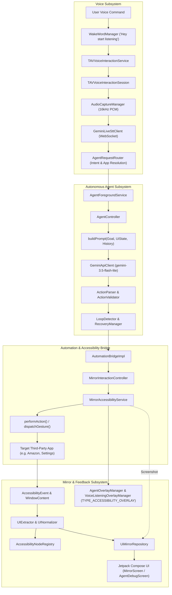
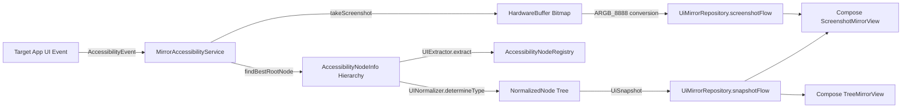
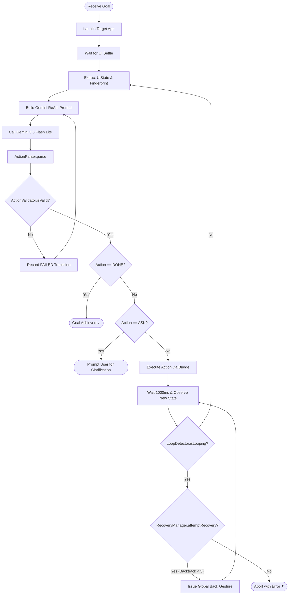

# Teachable Voice Automation (TAV) — Mirror UI

[](https://kotlinlang.org/)
[](https://developer.android.com)
[](https://developer.android.com/jetpack/compose)
[](https://ai.google.dev/)
[](#architecture)
[](#native-on-device-inference-llamacpp)

> **Teachable Voice Automation (TAV)** is an autonomous Android UI agent and remote application mirroring platform. It pairs Android's accessibility and voice interaction frameworks with Google Gemini models to inspect third-party apps, mirror their interfaces in real time, listen for natural speech commands, and autonomously execute complex multi-step user workflows directly on the device.

---

## Table of Contents

- [Overview](#overview)
- [System Architecture](#system-architecture)
- [Key Features](#key-features)
- [Deep Dive: Special Android Components](#deep-dive-special-android-components)
- [Data Flow & Execution Pipelines](#data-flow--execution-pipelines)
  - [1. End-to-End Voice-Driven Autonomous Execution](#1-end-to-end-voice-driven-autonomous-execution)
  - [2. UI Extraction & Remote Mirroring Pipeline](#2-ui-extraction--remote-mirroring-pipeline)
  - [3. Touch Coordinate & Gesture Forwarding](#3-touch-coordinate--gesture-forwarding)
  - [4. Agent Reasoning, Loop Detection & Recovery](#4-agent-reasoning-loop-detection--recovery)
- [Repository Structure](#repository-structure)
- [Tech Stack & Dependencies](#tech-stack--dependencies)
- [Android Configuration & Permissions](#android-configuration--permissions)
- [Setup & Build Instructions](#setup--build-instructions)
- [Known Limitations & Design Constraints](#known-limitations--design-constraints)

---

## Overview

Modern mobile assistants often stop at intent matching or opening deep links. **Teachable Voice Automation (TAV)** bridges the gap between natural language understanding and system-wide UI manipulation. It solves two challenging Android problems:

1. **Remote In-App UI Mirroring (`Mirror UI`)**: Using an `AccessibilityService` alongside Android 11+ display capture, TAV captures the live visual and structural hierarchy of third-party apps (e.g., Amazon, Zomato, Settings). Users can view and interact with these external apps directly from within TAV using either a pixel-accurate **Screenshot View** (with touch target overlays and coordinate translation) or a structured **Component Tree View** (with auto-extracted controls, scroll containers, and rich card summaries).
2. **Autonomous Multi-Step Goal Execution (`Agent`)**: When given a high-level goal (via voice or text, such as *"Open Amazon and find 5 packets of milk"*), TAV converts spoken audio into text via WebSocket-streamed **Gemini Live STT**, routes the request to target package names, launches a dedicated foreground service, and runs an autonomous **Observe-Think-Act** loop powered by **Gemini 3.5 Flash Lite**. The agent evaluates live UI accessibility trees, generates validated JSON actions (`CLICK`, `INPUT`, `SCROLL`, `SWIPE`, `BACK`, `DONE`, `ASK`), detects dead ends/infinite loops, and drives the target app to completion while rendering a translucent non-intrusive status HUD on top of the screen.

---

## System Architecture

The application is structured into decoupled domain packages ensuring clean separation of concerns:

```
com.example.teachablevoice
├── (root)                  # Mirror UI, Accessibility Service, Tree Normalization, Main Activity
├── agent                   # Autonomous Agent Controller, State, Loop Detection, Foreground Service, HUD
├── bridge                  # Abstraction layer between Agent logic and Android Accessibility
├── model                   # LLM backends (GeminiApiClient via REST, LlamaCppBackend via JNI)
├── voice                   # VoiceInteractionService, Session, Gemini Live WebSocket STT, Wake Word
└── ui.theme                # Jetpack Compose Dark/Light Material3 theme definitions
```

### High-Level Architectural Flow



---

## Key Features

### 1. Dual-Mode Remote App Mirroring
- **Screenshot Mirror View**:
  - Leverages Android 11+ (`Build.VERSION_CODES.R`) `AccessibilityService.takeScreenshot()` to capture hardware bitmaps from the primary display.
  - Scales bitmaps dynamically to screen bounds and projects interactive bounding boxes for clickable, editable, and scrollable nodes using Compose `Canvas`.
  - Translates pointer gestures on the screenshot canvas into real screen coordinate taps, long presses, and swipes dispatched to the target app via `AccessibilityService.dispatchGesture()`.
- **Tree Mirror View**:
  - Recursively traverses accessibility node hierarchies up to 50 levels deep.
  - Normalizes vendor-specific view classes into universal `NodeType` elements (`Button`, `TextField`, `Checkbox`, `Toggle`, `Dropdown`, `Image`, `List`, `Card`, `ScrollableContainer`, `Text`).
  - Preprocesses UI trees into flattened, deduplicated components with breadcrumb text extraction for complex nested layouts (e.g., restaurant cards in food delivery apps).
  - Displays interactive scroll controllers with upward/downward scroll action triggers.

### 2. In-Mirror Text Input (`MirrorTextInputDialog`)
- When tapping an editable input field inside the mirrored screenshot view, TAV does not switch apps or trigger an IME in the background app.
- Instead, it detects `node.editable`, reads existing text and hints, and opens a modal Compose dialog (`MirrorTextInputDialog`).
- Submitted text is dispatched directly through `AccessibilityNodeInfo.ACTION_SET_TEXT` with `Bundle` arguments without invoking `ACTION_FOCUS` (which would otherwise force Android to bring the third-party app to the foreground).

### 3. System-Integrated Digital Assistant
- Registers as an official Android `VoiceInteractionService` and `VoiceInteractionSessionService`.
- Selectable as the default **Digital Assistant App** under Android settings (`Settings.ACTION_VOICE_INPUT_SETTINGS`).
- System-managed lifecycle prevents process kills and background-start exceptions without requiring persistent notification clutter.

### 4. Streaming Voice Recognition (Gemini Live STT)
- Real-time PCM audio capture at 16kHz, 16-bit mono using `AudioRecord`.
- Bidirectional streaming over WebSockets to Google's Gemini Live API (`wss://generativelanguage.googleapis.com/ws/google.ai.generativelanguage.v1beta.GenerativeService.BidiGenerateContent`).
- Sends Base64-encoded PCM frames inside `realtimeInput.audio` and receives real-time partial and final transcripts.
- Integrated debouncing with 2-second silence detection and 7-second hard timeouts.
- Fallback voice input support via platform `SpeechRecognizer` (`VoiceInputManager`).

### 5. Local Wake-Word Engine (`WakeWordManager`)
- Stage A lightweight hotword detection engine trained on `"Hey start listening"`.
- Uses fuzzy multi-keyword threshold matching (`hey`, `start`, `listening`) to tolerate pronunciation variations and interim STT outputs.
- Completely local processing—the wake phrase is never transmitted to cloud LLMs.

### 6. Natural Language Request Router (`AgentRequestRouter`)
- Transforms unstructured voice commands into structured JSON intent objects before triggering any UI interaction:
  ```json
  {
    "intent": "AUTOMATE",
    "target_app": "Amazon",
    "task": "Find 5 packets of milk",
    "parameters": { "quantity": 5, "item": "milk" }
  }
  ```
- Resolves human-readable app names to installed package names using `AppResolver`, semantic category fallbacks (e.g. "message" $\to$ SMS app, "dial" $\to$ phone app), and a dictionary of known popular applications.

### 7. Autonomous Agent Controller (`AgentController`)
- **Observe-Think-Act Cycle**:
  1. Launches target application and pauses for UI settling.
  2. Extracts sanitized interactive elements (`UiElement`), filtering out decorative and non-interactive views.
  3. Computes a stable screen state `fingerprint` from visible element IDs and roles.
  4. Formulates a structured system prompt containing current app package, UI fingerprint, interactive elements, recent actions, and prior failed attempts.
  5. Queries **Gemini 3.5 Flash Lite** with `responseMimeType = "application/json"`.
  6. Parses response via `ActionParser` into one of 13 supported `ActionType` commands:
     - `OPEN_APP`, `CLICK`, `LONG_CLICK`, `INPUT`, `SCROLL`, `SWIPE`, `BACK`, `HOME`, `RECENTS`, `NOTIFICATIONS`, `WAIT`, `DONE`, `ASK`.
  7. Validates target nodes against the current screen hierarchy (`ActionValidator`).
  8. Executes the action via `AutomationBridgeImpl` and waits for UI state transition.
  9. Evaluates state change (`TransitionResult.SUCCESS` vs. `NO_STATE_CHANGE`).
  10. Concludes immediately when the model outputs `{"action": "DONE"}` or requires clarification via `{"action": "ASK"}`.

### 8. Loop Detection & Heuristic Recovery
- **`LoopDetector`**: Monitors sliding transition histories. Detects state oscillations ($A \to B \to A \to B$) and repeated non-functional actions ($2\times \text{NO\_STATE\_CHANGE}$).
- **`RecoveryManager`**: Intervenes when an agent gets stuck by issuing automatic navigation recovery (`GLOBAL_ACTION_BACK`) up to 5 times before failing gracefully.

### 9. Zero-Permission Translucent Overlays
- Android normally requires the dangerous `SYSTEM_ALERT_WINDOW` permission to draw floating overlays.
- TAV leverages `WindowManager.LayoutParams.TYPE_ACCESSIBILITY_OVERLAY` through `MirrorAccessibilityService`. This allows:
  - **`VoiceListeningOverlayManager`**: Slides down from the top to show microphone status and live transcription.
  - **`AgentOverlayManager`**: Floats at the bottom above target applications showing real-time step counts, pulsing progress indicators, and an immediate emergency stop (`■ STOP`) button.

### 10. Local On-Device Inference (`LlamaCppBackend`)
- Retains native C++ JNI bindings (`tav_llama_jni.cpp`) compiled with CMake and linked to `llama.cpp`.
- Capable of running quantized GGUF models (e.g., `LittleLamb-290M.gguf`) locally on ARM64 devices with greedy sampling and early JSON closure detection.

---

## Deep Dive: Special Android Components

| Android Component | Class / File | Purpose & Implementation Details |
|---|---|---|
| **Accessibility Service** | `MirrorAccessibilityService.kt`<br>`accessibility_service_config.xml` | Core automation spine. Subscribes to `typeWindowStateChanged`, `typeWindowContentChanged`, `typeViewScrolled`. Extracts root views across multi-window environments (`findBestRootNode`), executes accessibility actions (`ACTION_CLICK`, `ACTION_SET_TEXT`, `ACTION_SCROLL_FORWARD`), captures display screenshots, and hosts accessibility overlays. |
| **Voice Interaction Service** | `TAVVoiceInteractionService.kt`<br>`voice_interaction_service.xml` | System voice service integrating with Android's voice assistant architecture. Configured with `sessionService`, `recognitionService`, and `supportsAssist="true"`. |
| **Voice Interaction Session** | `TAVVoiceInteractionSession.kt`<br>`TAVVoiceInteractionSessionService.kt` | Manages active voice interaction window. Coordinates raw microphone recording, Gemini Live WebSocket connections, and transitions to the agent pipeline. |
| **Foreground Service** | `AgentForegroundService.kt` | Keeps the background execution thread alive while the user is inside a target application. Declares `android:foregroundServiceType="specialUse"` and maintains a persistent notification on `agent_channel`. |
| **Accessibility Overlay** | `AgentOverlayManager.kt`<br>`VoiceListeningOverlayManager.kt` | Creates programmatic, non-XML layouts added directly to `WindowManager` with `TYPE_ACCESSIBILITY_OVERLAY`. Allows drawing interactive UI above other apps without `SYSTEM_ALERT_WINDOW`. |
| **Audio Capture** | `AudioCaptureManager.kt` | Direct hardware capture via `AudioRecord(MediaRecorder.AudioSource.MIC, 16000, CHANNEL_IN_MONO, ENCODING_PCM_16BIT)`. Streams audio buffers asynchronously using coroutines on `Dispatchers.IO`. |
| **Platform Speech Recognizer** | `VoiceInputManager.kt` | Wraps `android.speech.SpeechRecognizer` with `RecognizerIntent.ACTION_RECOGNIZE_SPEECH` for partial and final result handling as an alternative/wake-listener STT. |
| **Gesture Injection** | `MirrorAccessibilityService.kt` | Uses `dispatchGesture()` with `GestureDescription.StrokeDescription` to inject programmatic path taps and swipe gestures at absolute screen coordinates. |
| **Native C++ / JNI** | `CMakeLists.txt`<br>`tav_llama_jni.cpp`<br>`LlamaCppBackend.kt` | Native integration with `llama.cpp` using NDK 25, C++17, and ARM64-v8a ABI filters. Handles model loading from internal storage, tokenization, KV cache clearing, and token generation. |
| **Jetpack Compose UI** | `MainActivity.kt`<br>`MirrorRenderer.kt`<br>`AppLauncherScreen.kt`<br>`AgentDebugScreen.kt` | Modern declarative UI with single-activity navigation (`Mirror`, `Apps`, `Model`, `Agent`), custom canvas rendering, and animated state transitions. |

---

## Data Flow & Execution Pipelines

### 1. End-to-End Voice-Driven Autonomous Execution

```mermaid
sequenceDiagram
    autonumber
    actor User
    participant Mic as AudioRecord / SpeechRecognizer
    participant Wake as WakeWordManager
    participant Session as TAVVoiceInteractionSession
    participant LiveSTT as Gemini Live API (WebSocket)
    participant Router as AgentRequestRouter
    participant FgService as AgentForegroundService
    participant Agent as AgentController
    participant Gemini as Gemini 3.5 Flash Lite (REST)
    participant Bridge as AutomationBridgeImpl
    participant Acc as MirrorAccessibilityService
    participant Target as Target Third-Party App

    User->>Mic: "Hey start listening, open Amazon and find milk"
    Mic->>Wake: Streamed speech text
    Wake->>Session: Wake phrase detected ("Hey start listening")
    Session->>LiveSTT: Stream 16kHz PCM audio
    LiveSTT-->>Session: Final Transcript: "open Amazon and find milk"
    Session->>Router: route("open Amazon and find milk")
    Router->>Gemini: Intent classification prompt
    Gemini-->>Router: {"intent":"AUTOMATE","target_app":"Amazon","task":"find milk"}
    Router->>FgService: Start Foreground Service (task, package)
    FgService->>Agent: execute(Goal("in.amazon.mShop...", "find milk"))
    
    rect rgb(25, 25, 45)
        note right of Agent: Autonomous Execution Loop
        Agent->>Bridge: openApp("in.amazon.mShop...")
        Bridge->>Target: launchApp()
        Target-->>Acc: AccessibilityEvents
        Acc-->>Agent: UiState (elements, fingerprint)
        Agent->>Gemini: Prompt with current screen & goal
        Gemini-->>Agent: {"action":"CLICK", "element_id":"node_14"}
        Agent->>Bridge: click("node_14")
        Bridge->>Acc: performAction(ACTION_CLICK)
        Acc->>Target: Click event
        Target-->>Acc: UI updates
        Acc-->>Agent: New UiState
        Agent->>Gemini: Next prompt...
        Gemini-->>Agent: {"action":"DONE"}
    end
    Agent->>FgService: Task completed
    FgService-->>User: Notification & HUD update ("Done ✓")
```



### 2. UI Extraction & Remote Mirroring Pipeline



### 3. Touch Coordinate & Gesture Forwarding

When interacting through the **Screenshot Mirror**:
1. User taps or drags on the Compose `Image` showing the mirrored bitmap.
2. `detectTapGestures` calculates screen scale factors:
   $$\text{scaleX} = \frac{\text{screenshot.width}}{\text{view.width}}, \quad \text{scaleY} = \frac{\text{screenshot.height}}{\text{view.height}}$$
3. `MirrorInteractionController.requestCoordinateTap(realX, realY)` emits a coordinate command.
4. `MirrorAccessibilityService` searches the normalized tree for the deepest interactive node containing $(x, y)$:
   - **Case A (Editable Node)**: Opens `MirrorTextInputDialog` locally in TAV. Text is forwarded directly via `ACTION_SET_TEXT`.
   - **Case B (Clickable Node)**: Calls `node.performAction(AccessibilityNodeInfo.ACTION_CLICK)`.
   - **Case C (No Accessibility Node / Canvas View)**: Fallback to `dispatchGesture()` with a 50ms tap path at $(x, y)$.

### 4. Agent Reasoning, Loop Detection & Recovery



---

## Repository Structure

```text
TeachableVoiceAutomation/
├── gradle/
│   ├── wrapper/
│   │   ├── gradle-wrapper.jar
│   │   └── gradle-wrapper.properties         # Gradle 9.x distribution
│   ├── gradle-daemon-jvm.properties
│   └── libs.versions.toml                     # Version catalog (AGP, Compose, Kotlin, Lifecycle)
├── app/
│   ├── src/
│   │   ├── main/
│   │   │   ├── cpp/
│   │   │   │   ├── CMakeLists.txt             # Native build configuration for llama.cpp
│   │   │   │   └── tav_llama_jni.cpp          # JNI bridge: loadNative, generateNative, unloadNative
│   │   │   ├── java/com/example/teachablevoice/
│   │   │   │   ├── AccessibilityNodeRegistry.kt  # Thread-safe node ID to AccessibilityNodeInfo cache
│   │   │   │   ├── AppLauncherScreen.kt       # Apps tab: installed launcher query & launcher UI
│   │   │   │   ├── MainActivity.kt            # Single activity host, Compose tabs & voice status bar
│   │   │   │   ├── MirrorAccessibilityService.kt # Accessibility core, event interceptor & gesture dispatcher
│   │   │   │   ├── MirrorInteractionController.kt# Event bus for clicks, gestures, swipes, and text input
│   │   │   │   ├── MirrorRenderer.kt          # Compose UI for Screenshot and Tree mirror rendering
│   │   │   │   ├── ModelChatScreen.kt         # Model tab: interactive prompt/response testing UI
│   │   │   │   ├── NormalizedNode.kt          # Domain UI node data model and NodeType enum
│   │   │   │   ├── UIExtractor.kt             # Recursive traversal of AccessibilityNodeInfo into NormalizedNode
│   │   │   │   ├── UiMirrorRepository.kt      # StateFlow holder for UI snapshots and screenshots
│   │   │   │   ├── UINormalizer.kt            # View class to NodeType mapping heuristic
│   │   │   │   ├── UiSnapshot.kt              # Immutable container for mirrored UI hierarchy
│   │   │   │   ├── agent/
│   │   │   │   │   ├── ActionParser.kt        # JSON response parser for agent actions
│   │   │   │   │   ├── ActionValidator.kt     # Validates actions against active screen elements
│   │   │   │   │   ├── AgentAction.kt         # ActionType enum & AgentAction data class
│   │   │   │   │   ├── AgentController.kt     # Core autonomous Observe-Think-Act control loop
│   │   │   │   │   ├── AgentDebugScreen.kt    # Agent tab: goal input, state metrics & live trace log
│   │   │   │   │   ├── AgentForegroundService.kt # Foreground service keeping agent alive during execution
│   │   │   │   │   ├── AgentOverlayManager.kt # Translucent floating HUD on top of target apps
│   │   │   │   │   ├── AgentState.kt          # Observable agent state repository and execution logs
│   │   │   │   │   ├── AppResolver.kt         # Resolves natural app names to package identifiers
│   │   │   │   │   ├── Goal.kt                # Goal domain model (app, objective, parameters)
│   │   │   │   │   ├── LoopDetector.kt        # Detects state oscillation and stagnant cycles
│   │   │   │   │   ├── RecoveryManager.kt     # Heuristic recovery via backtracking navigation
│   │   │   │   │   └── UiState.kt             # Agent screen representation & fingerprint calculation
│   │   │   │   ├── bridge/
│   │   │   │   │   ├── AutomationBridge.kt    # Automation interface definition
│   │   │   │   │   └── AutomationBridgeImpl.kt# Bridge implementation binding controller to accessibility
│   │   │   │   ├── model/
│   │   │   │   │   ├── GeminiApiClient.kt     # Gemini REST client (gemini-3.5-flash-lite)
│   │   │   │   │   ├── LlamaCppBackend.kt     # JNI backend for local GGUF execution
│   │   │   │   │   ├── ModelBackend.kt        # Common model backend interface
│   │   │   │   │   └── ModelManager.kt        # Backend singleton provider
│   │   │   │   ├── ui/theme/
│   │   │   │   │   ├── Color.kt               # Design palette
│   │   │   │   │   ├── Theme.kt               # Material3 theme configuration
│   │   │   │   │   └── Type.kt                # Typography definitions
│   │   │   │   └── voice/
│   │   │   │       ├── AgentRequestRouter.kt  # Natural language command to AgentRequest router
│   │   │   │       ├── AudioCaptureManager.kt # 16kHz PCM audio capture via AudioRecord
│   │   │   │       ├── GeminiLiveSttClient.kt # Gemini Live WebSocket client for real-time STT
│   │   │   │       ├── TAVVoiceInteractionService.kt # VoiceInteractionService implementation
│   │   │   │       ├── TAVVoiceInteractionSession.kt # VoiceInteractionSession implementation
│   │   │   │       ├── TAVVoiceInteractionSessionService.kt # Session service binding
│   │   │   │       ├── VoiceInputListener.kt  # STT event listener interface
│   │   │   │       ├── VoiceInputManager.kt   # Platform SpeechRecognizer wrapper
│   │   │   │       ├── VoiceListeningOverlayManager.kt # Translucent floating voice HUD
│   │   │   │       ├── VoiceStateRepository.kt# Observable voice listener state
│   │   │   │       └── WakeWordManager.kt     # Fuzzy wake-phrase detector ("Hey start listening")
│   │   │   ├── keepRules/
│   │   │   │   └── rules.keep                 # R8/ProGuard retention definitions
│   │   │   ├── res/
│   │   │   │   ├── values/
│   │   │   │   │   ├── colors.xml
│   │   │   │   │   ├── strings.xml            # App name ("Mirror UI") & service descriptions
│   │   │   │   │   └── themes.xml
│   │   │   │   └── xml/
│   │   │   │       ├── accessibility_service_config.xml # Accessibility flags and capabilities
│   │   │   │       ├── backup_rules.xml
│   │   │   │       ├── data_extraction_rules.xml
│   │   │   │       └── voice_interaction_service.xml    # Voice interaction configuration
│   │   │   └── AndroidManifest.xml            # Manifest declaring services, permissions & launcher
│   │   ├── test/                              # Host-side unit tests
│   │   └── androidTest/                       # Instrumentation tests
│   └── build.gradle.kts                       # App build script: NDK, Compose, BuildConfig & dependencies
├── build.gradle.kts                           # Root Gradle script
├── gradle.properties                          # JVM & AndroidX properties
└── settings.gradle.kts                        # Plugin repositories & module definitions
```

---

## Tech Stack & Dependencies

### Core Frameworks & Languages
- **Kotlin**: `2.2.10`
- **Android Gradle Plugin (AGP)**: `9.4.1`
- **Gradle JVM**: Java 11 target compatibility
- **Android SDK**: `minSdk = 26` (Android 8.0 Oreo), `targetSdk = 37`, `compileSdk = 37`
- **NDK**: `25.1.8937393` with CMake `3.22.1` and C++17

### Production Dependencies
| Dependency | Version | Purpose in Architecture |
|---|---|---|
| `com.squareup.okhttp3:okhttp` | `4.12.0` | Establishes bidirectional WebSockets for `GeminiLiveSttClient` to stream raw audio and receive live transcripts. |
| `androidx.compose.bom` | `2026.02.01` | Bill of Materials ensuring harmonized Compose library versions. |
| `androidx.activity:activity-compose` | `1.8.0` | Provides Compose entrypoint (`setContent`), system back handlers, and activity result launchers. |
| `androidx.compose.material3:material3` | Dynamic | Material Design 3 UI components, themes, buttons, cards, and text fields. |
| `androidx.compose.ui:ui` & `ui-graphics` | Dynamic | Foundational UI rendering, pointer gesture detection, canvas drawing, and layout measurement. |
| `androidx.core:core-ktx` | `1.10.1` | Kotlin extensions for Android framework classes, permissions, and notifications. |
| `androidx.lifecycle:lifecycle-runtime-ktx`| `2.6.1` | Lifecycle coroutine scopes and integration with Compose state collection (`collectAsState`). |
| `org.json` | Platform | Built-in Android JSON parsing used by `ActionParser`, `GeminiApiClient`, and `AgentRequestRouter`. |
| `java.net.HttpURLConnection` | Platform | Lightweight, dependency-free HTTPS transport used in `GeminiApiClient`. |

---

## Android Configuration & Permissions

TAV requires specific Android capabilities to operate as an automated agent and accessibility mirror:

```xml
<!-- Network communication with Gemini API & Live WebSockets -->
<uses-permission android:name="android.permission.INTERNET" />

<!-- Enumerate installed applications on Android 11+ (API 30+) for app resolution -->
<uses-permission android:name="android.permission.QUERY_ALL_PACKAGES" tools:ignore="QueryAllPackagesPermission" />

<!-- Foreground execution capabilities -->
<uses-permission android:name="android.permission.FOREGROUND_SERVICE" />
<uses-permission android:name="android.permission.FOREGROUND_SERVICE_SPECIAL_USE" />
<uses-permission android:name="android.permission.FOREGROUND_SERVICE_MICROPHONE" />

<!-- Microphone audio recording for speech-to-text -->
<uses-permission android:name="android.permission.RECORD_AUDIO" />
```

### Component Declarations
- **`MainActivity`**: Exported launcher activity configured with `windowSoftInputMode="adjustResize"`.
- **`MirrorAccessibilityService`**:
  - Bound via `android.permission.BIND_ACCESSIBILITY_SERVICE`.
  - Flags: `flagDefault`, `flagRetrieveInteractiveWindows`, `flagIncludeNotImportantViews`.
  - Capabilities: `canRetrieveWindowContent="true"`, `canPerformGestures="true"`.
- **`AgentForegroundService`**:
  - Internal execution service (`exported="false"`, `foregroundServiceType="specialUse"`).
- **`TAVVoiceInteractionService`**:
  - System assistant service bound via `android.permission.BIND_VOICE_INTERACTION`.
  - Configured with `supportsAssist="true"`, `supportsLaunchVoiceAssistFromKeyguard="true"`, and `supportsLocalInteraction="true"`.
- **`TAVVoiceInteractionSessionService`**:
  - Session manager bound via `android.permission.BIND_VOICE_INTERACTION_SERVICE`.

---

## Setup & Build Instructions

### Prerequisites
1. **Android Studio** (Koala / Ladybug or newer recommended).
2. **Android SDK Platform 37** installed via SDK Manager.
3. **Android NDK** `25.1.8937393` and **CMake** `3.22.1` installed via SDK Tools.
4. An Android device or emulator running **Android 11+ (API 30+)** for screenshot mirroring and voice interaction.
5. A **Google Gemini API Key** from [Google AI Studio](https://aistudio.google.com/).

### 1. Configure API Credentials
Create or edit `local.properties` in the project root directory (do not commit this file):

```properties
# local.properties
sdk.dir=/path/to/your/android-sdk
GEMINI_API_KEY=your_gemini_api_key_here
```

`app/build.gradle.kts` injects this property directly into `BuildConfig.GEMINI_API_KEY` at build time.

### 2. Build the Project
Open terminal in the repository root:

```bash
# Build debug APK
./gradlew assembleDebug

# Install directly to connected device
./gradlew installDebug
```

### 3. Required Device Permissions & Settings
Once installed, configure the required device permissions:

1. **Enable Accessibility Service**:
   - Open **Settings** $\to$ **Accessibility** $\to$ **Downloaded Apps** (or **Installed Services**).
   - Locate **Mirror UI** and toggle it **ON**. Grant full control when prompted.
2. **Grant Microphone Permission**:
   - Launch **Mirror UI**. Tap the voice status banner at the top to grant the `RECORD_AUDIO` permission.
3. **Set Default Digital Assistant** (Optional for background voice activation):
   - Tap the voice banner or navigate to **Settings** $\to$ **Apps** $\to$ **Default Apps** $\to$ **Digital Assistant App**.
   - Select **Mirror UI** (or **Teachable Voice Automation**) as the default assist app.

---

## Known Limitations & Design Constraints

1. **Screenshot Capture API Level**:
   - Visual screenshot capture relies on `AccessibilityService.takeScreenshot()`, which requires **Android 11 (API 30)** or higher. On Android 10 and below, TAV automatically falls back to **Tree Mirror Mode**.
2. **Foreground App Exclusions**:
   - To avoid recursive self-mirroring loops and capture corruption, `MirrorAccessibilityService` deliberately ignores events originating from `com.example.teachablevoice`, `com.android.systemui`, and launcher packages (`com.android.launcher*`).
3. **System Alert Window Alternative**:
   - TAV deliberately avoids requesting the invasive `SYSTEM_ALERT_WINDOW` permission by using `TYPE_ACCESSIBILITY_OVERLAY`. As a result, overlays can only be displayed when the accessibility service is active.
4. **Target App Rendering Latency**:
   - When switching or launching applications, TAV injects deliberate stabilization delays (e.g., 2000ms after app launch, 1000ms after UI actions) to allow third-party animations and dynamic layouts to settle before extracting the accessibility hierarchy.
5. **ABI Architecture**:
   - Native builds (`libtav_llama.so`) specify `abiFilters += listOf("arm64-v8a")`. If deploying to 32-bit ARM or x86/x86_64 emulators, adjust the ABI filters in `app/build.gradle.kts`.

---

## License

This project is licensed under the terms defined in the repository source code. See the source headers for additional details.
